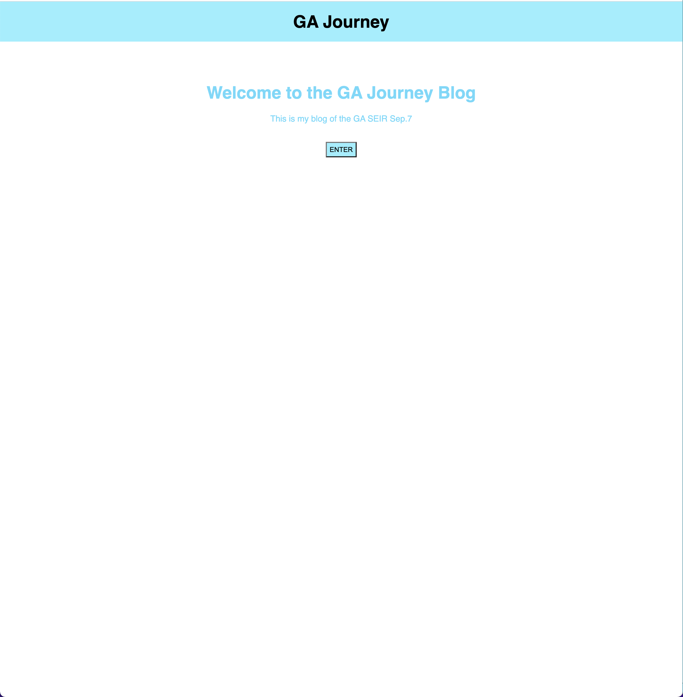
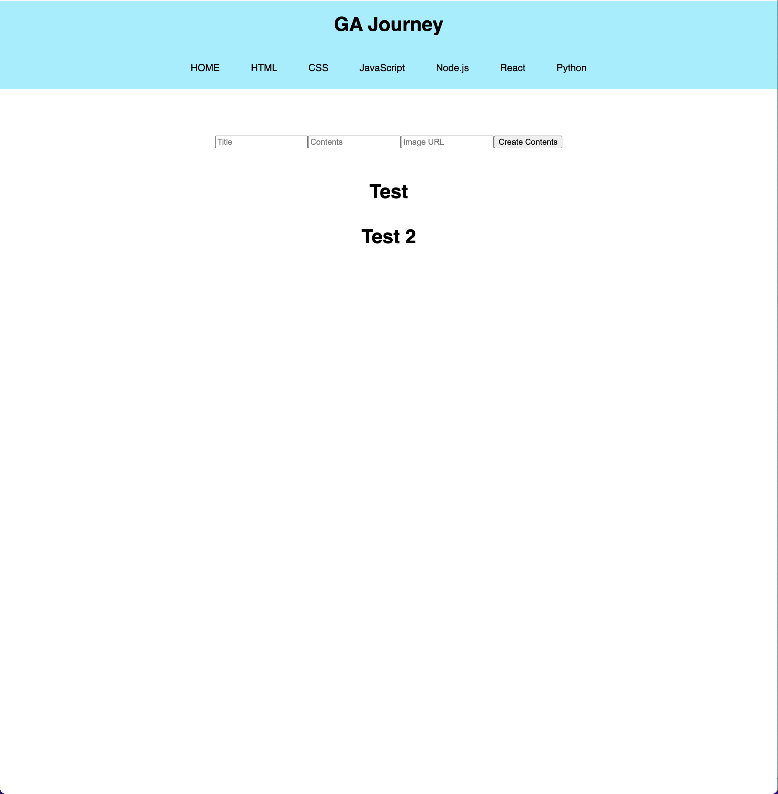
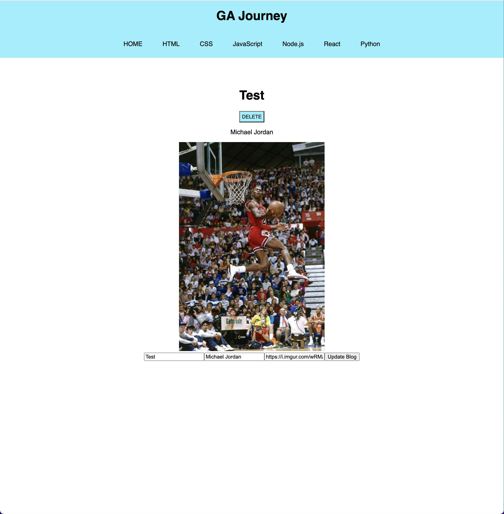

# GA Journey

The material in General Assembly, convenient and easy to clean up if we have the note the idea of creating this app.

## Technologies Used

React
SASS
Node.js
Express
Mongoose/MongoDB

## Screenshots

## Getting Started

The Project's planning: [https://trello.com/b/h8F6OHES/the-blog-for-ga-journey]
This is deployed app on <a href=''>Netlify</a>

## Future Enhancements

